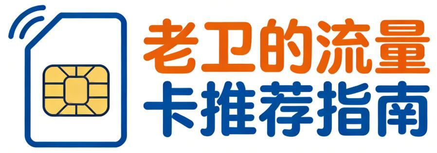

# Data SIM card recommendation. 老卫的流量卡推荐指南

不知道有没有人和我一样，被流量不够用、月租虚高的问题困扰了很久😭 尤其是学生党在宿舍、出差党跑外勤、租房党没装宽带，流量就是刚需，但市面上的流量卡五花八门，稍不注意就踩坑——要么宣传的“大流量”全是定向，要么首月便宜次月暴涨，要么限速阈值低到离谱，甚至还有隐形合约，注销要扣钱。

我个人因为经常会买流量卡作为副卡，也被坑过，因此整理出这份避坑+推荐指南，不管你是每月用几十G还是几百G，不管是追求低价还是稳定，都能找到适合自己的，最后也会分享我实测后觉得靠谱的几款。

关注以下任意仓库均可：

* <https://github.com/waylau/data-sim-card-recommendation>
* <https://gitee.com/waylau/data-sim-card-recommendation>

## 一、先搞懂3个核心问题，避免90%的坑

很多人买流量卡被坑，本质是没看清这3点，被商家的宣传话术带偏了，先把这几点记牢，再选卡绝对不踩雷：

- **分清“通用流量”和“定向流量”**：这是最容易踩坑的点！很多卡宣传“200G流量”，其实180G都是定向（只能用某几个APP），通用流量只有20G，刷视频、逛网页根本不够用。选卡时一定要看清楚，通用流量占比越高越好，定向流量再多，用不上也等于白搭。

- **看明白“优惠期”和“合约期”**：几乎所有低价流量卡都有优惠期（一般6-12个月），优惠期内月租很便宜，但优惠期结束后会恢复原价（可能从9元涨到29元、39元），一定要提前看清楚优惠期时长和后续原价。另外，部分卡有合约期（比如6个月），合约期内注销要扣违约金，短期用的话一定要选无合约的。

- **确认“限速规则”**：没有真正“不限速”的流量卡（这是行业红线，商家说不限速都是假的），大部分卡是通用流量用满一定额度后限速（比如100G后限速3Mbps，200G后限速1Mbps），限速后能正常聊微信、刷文字，但看视频会卡顿，根据自己的使用量选限速阈值就行。

## 二、不同人群最优选择（实测靠谱，无套路）

我根据不同使用场景，整理了3类人群的适配卡，每一款都实测过，没有隐形消费，大家可以对号入座：

### 1. 学生党（预算低、流量需求大）

核心需求：低价、通用流量足、无合约（寒暑假可以注销），适合宿舍没宽带、日常刷视频、玩游戏的学生。

适配类型：月租19元以内，通用流量50-100G，定向流量100-200G，优惠期12个月，无合约，支持线上注销，激活首充50元可享优惠，限速阈值100G（日常用完全够，不怎么卡顿）。

### 2. 出差党（全国通用、稳定不卡顿）

核心需求：全国通用、信号稳定、不限地区使用，偶尔跨省出差，需要随时联网办公、导航。

适配类型：月租29元以内，通用流量100-150G，定向流量不限，优惠期12个月，支持全国漫游，无地区限速（部分偏远地区除外，以运营商为准），限速阈值200G，适合高频使用。

### 3. 租房党（短期使用、灵活注销）

核心需求：无合约、可随时注销、流量够用，暂时没装宽带，或者租房时间不确定，不想被绑定。

适配类型：月租9-19元，通用流量30-50G，定向流量100G，优惠期6个月，无合约，激活无强制首充，用完可直接线上注销，适合短期过渡使用。

## 三、绝对不能碰的“坑卡”（避坑指南）

实测过程中，遇到很多套路卡，大家看到以下几种情况，直接pass，别浪费时间：

1. 宣传“永久0元”“无限流量”“不限速”的：全是虚假宣传，要么首月免费，次月暴涨，要么流量用一点就限速，甚至直接断网。

2. 不说明优惠期和原价的：大概率是优惠期3个月，之后月租涨到39元以上，而且可能有隐形合约，注销要扣钱。

3. 通用流量占比低于30%的：比如200G流量里，通用只有50G，定向150G，看似流量多，实际根本不够用。

4. 需要线下注销、或者注销要收手续费的：现在正规流量卡都支持线上注销（运营商APP操作），需要线下跑营业厅的，大概率是小众卡，售后没保障。

## 四、测评记录集合

选流量卡，没有最好的，只有最适合自己的，不用追求“流量越多越好”，够用、稳定、无套路才是关键。另外，一定要通过正规渠道申请，避免买到物联网卡（不能接打电话、信号差、容易被封）。

以下我的流量卡测评记录集合

* [联通卡](https://space.bilibili.com/7681787/search?keyword=%E8%81%94%E9%80%9A)
* [广电卡](https://space.bilibili.com/7681787/search?keyword=%E5%B9%BF%E7%94%B5)
* [电信卡](https://space.bilibili.com/7681787/search?keyword=%E7%94%B5%E4%BF%A1)
* [移动卡](https://space.bilibili.com/7681787/search?keyword=%E7%A7%BB%E5%8A%A8)
* [随行WiFi](https://space.bilibili.com/7681787/search?keyword=%E9%9A%8F%E8%A1%8CWiFi)

我把实测后靠谱的流量卡整理成了清单放在最后，包含详细的月租、流量、优惠期、注销规则，避免大家再花时间筛选。

## 五、线上销户指南

联通、电信、移动、广电、随行WiFi的流量卡，都支持线上销户，但有坑，大家一定要看 carefully：

* [广电手机卡线上销户过程丝滑](https://www.bilibili.com/video/BV1xdAbzEE1m/)

## 六、流量卡推荐清单

由于流量卡运营周期不确定，短则几天就下架，因此本仓库也会尽量及时更新，增删上架下架的产品。
大家看中好的流量卡及早下手。

### GY联通荣耀卡28元220G流量+0.15/分钟【只发广东】

https://m20260307.yapingkeji.com/pages/detail/index?goods_id=11722&agent_id=660080

商品介绍：
原套餐资费：38元/月=5G通用+30G定向流量 优惠后资费：28元/月=220G通用流+0.15元/分钟 套外流量5元/G，语音0.15元/分钟，短信,彩信0.1元/条
商品副标题： 上门激活，流量长期，首月全价，补贴5个月
首充描述： 任意渠道一次性充值100元
运营商/分类： 中国联通
归属地： 广东省
是否支持选号：
不支持

套餐信息
套餐时长（优惠期）： 二十年
通话时长： 0
通用流量(G)： 220
定向流量(G)： 0
原月租(元)： 38
优惠月租(元)： 28
限制信息
首充金额： ￥100
限龄规则： 18岁 至 60岁
禁发/发货地：
发货地
地区列表：
广东省

### GY广电巴岭卡28元350G+200分【只发重庆】

https://m20260228.yapingkeji.com/pages/detail/index?goods_id=11681&agent_id=660080

商品介绍：
原套餐:28元包含120G通用流量+200分钟全国通话 优惠后:28元/月=320G通用+30G定向+200分钟全国通话 套餐外:通话0.15元/分，短彩信0.1元/条，流量5元/G;
商品副标题： 快递激活，18-35周岁
首充描述： 快递上门激活充值100享受优惠
运营商/分类： 中国广电
归属地： 重庆市
是否支持选号：
不支持

套餐信息
套餐时长（优惠期）： 一年
通话时长： 200
通用流量(G)： 320
定向流量(G)： 30
原月租(元)： 28
优惠月租(元)： 28
限制信息
首充金额： ￥100
限龄规则： 18岁 至 35岁
禁发/发货地：
发货地
地区列表：
重庆市重庆市
重庆市

### GY移动胶东卡29元300G+100分钟【发山东10市】

https://m20260301.yapingkeji.com/pages/detail/index?goods_id=11653&agent_id=660080

商品介绍：
原套餐29元/月10G全国通用流量+100分钟 套餐优惠:29元=50G通用+50G定向+200G省内+100分钟通话 套餐超出后:国内流量10元/GB，国内通话0.19元/分钟，国内短信0.1元/条
商品副标题： 上门激活，只发山东，本地归属
首充描述： 激活后任意渠道一次性首充100元
运营商/分类： 中国移动
归属地： 山东省
是否支持选号：
不支持

套餐信息
套餐时长（优惠期）： 两年
通话时长： 100
通用流量(G)： 250
定向流量(G)： 50
原月租(元)： 29
优惠月租(元)： 29
限制信息
首充金额： ￥100
限龄规则： 18岁 至 60岁
禁发/发货地：
发货地
地区列表：
山东省济南市
山东省潍坊市
山东省淄博市
山东省枣庄市
山东省日照市
山东省临沂市
山东省泰安市
山东省济宁市
山东省威海市
山东省菏泽市

### 广电风华卡28元350G+200分钟【只发湖南】 

https://m20260301.yapingkeji.com/pages/detail/index?goods_id=11598&agent_id=660080

商品介绍：
原套餐资费：28元/月=120G通用流量（可转结）+30G定向流量+200分通话 优惠后资费：28元/月=320G通用流量+30G定向流量+200分通话 套餐外通话0.15元/分钟，短信0.1元/条，流量5元/G，全国接听免费。
商品副标题： 18-35岁，到期可续，只发湖南
首充描述： 快递处激活充值100元
运营商/分类： 中国广电
归属地： 湖南省
是否支持选号：
不支持

套餐信息
套餐时长（优惠期）： 一年
通话时长： 200
通用流量(G)： 320
定向流量(G)： 30
原月租(元)： 28
优惠月租(元)： 28
限制信息
首充金额： ￥100
限龄规则： 18岁 至 35岁
禁发/发货地：
发货地
地区列表：
湖南省

### GY联通蜀锦卡30.1元240G+200分钟【仅发四川】

https://m20260301.yapingkeji.com/pages/detail/index?goods_id=11655&agent_id=660080

商品介绍：
原套餐资费:首月29元,激活套餐内容仅50G通用流量 次月变更为39元含50分钟+40G通用流量+0.1元150分钟+200G通用流量 套餐外流量5元/G，通话0.15元/分钟，短彩信0.1元/条，国内接听免费;
商品副标题： 流量可续，只发四川
首充描述： 激活当月任意渠道一次性首充I00元
运营商/分类： 中国联通
归属地：
是否支持选号：
不支持

套餐信息
套餐时长（优惠期）： 三年
通话时长： 200
通用流量(G)： 240
定向流量(G)： 0
原月租(元)： 39
优惠月租(元)： 30.1
限制信息
首充金额： ￥100
限龄规则： 18岁 至 60岁
禁发/发货地：
发货地
地区列表：
四川省

### 广电无忧卡28元350G+200分【只发济南】 

https://m20260301.yapingkeji.com/pages/detail/index?goods_id=11567&agent_id=660080

商品介绍：
原套餐:28元120G通用+200分钟通话(套内流量结转) 优惠后:28元/月320G通用+30G定向+200分钟通话
商品副标题： 18-35周岁， 仅发济南
首充描述： 上门开卡过程中首充100元
运营商/分类： 中国广电
归属地： 山东省
是否支持选号：
不支持

套餐信息
套餐时长（优惠期）： 一年
通话时长： 200
通用流量(G)： 320
定向流量(G)： 30
原月租(元)： 28
优惠月租(元)： 28
限制信息
首充金额： ￥100
限龄规则： 18岁 至 35岁

### 广电冲浪卡28元350G+200分【发济南 青岛 潍坊】

https://m20260301.yapingkeji.com/pages/detail/index?goods_id=11490&agent_id=660080

商品介绍：
原套餐:28元包含120G通用流量+200分钟全国通话（套内流量结转） 优惠后:28元/月=320G通用+30G定向+200分钟全国通话
商品副标题： 京东/顺丰上门，18-35周岁
首充描述： 激活充值100享受优惠
运营商/分类： 中国广电
归属地：
是否支持选号：
不支持

套餐信息
套餐时长（优惠期）： 一年
通话时长： 200
通用流量(G)： 320
定向流量(G)： 30
原月租(元)： 28
优惠月租(元)： 28
限制信息
首充金额： ￥100
限龄规则： 18岁 至 35岁
禁发/发货地：
发货地
地区列表：
山东省青岛市
山东省济南市
山东省潍坊市

### 联通畅游卡29元150G+100分钟【只发浙江】 

https://m20260303.yapingkeji.com/pages/detail/index?goods_id=11661&agent_id=660080

商品介绍：
原套餐资费：59元/月=150G通用流量+100分钟通话 优惠后资费：29元/月=150G通用流量+100分钟通话 首月39元按天折算，套餐内容按天折算到账，套餐超出后5元/GB，语音0.15元/分钟，短信,彩信0.1元/条
商品副标题： 上门激活，只发浙江
首充描述： 激活当月任意渠道首充一次性充值100元
运营商/分类： 中国联通
归属地： 浙江省
是否支持选号：
不支持
套餐信息
套餐时长（优惠期）： 两年
通话时长： 100
通用流量(G)： 150
定向流量(G)： 0
原月租(元)： 39
优惠月租(元)： 29
限制信息
首充金额： ￥100
限龄规则： 18岁 至 60岁
禁发/发货地：
发货地
地区列表：
浙江省
浙江省杭州市
浙江省宁波市
浙江省温州市
浙江省嘉兴市
浙江省湖州市
浙江省绍兴市
浙江省金华市
浙江省衢州市
浙江省舟山市
浙江省台州市
浙江省丽水市

### 移动西湖卡29元165G+100分钟【只发浙江】 

https://m20260303.yapingkeji.com/pages/detail/index?goods_id=11672&agent_id=660080

商品介绍：
原套餐:69元/月15G全国通用+100分钟通话 套餐外:通话0.19元/分钟，短信0.1元/条，流量10元/G，全国接听免费
商品副标题： 上门激活，只发浙江
首充描述： 激活后专属渠道充值200元
运营商/分类： 中国移动
归属地： 浙江省
是否支持选号：
不支持

套餐信息
套餐时长（优惠期）： 两年
通话时长： 100
通用流量(G)： 165
定向流量(G)： 0
原月租(元)： 69
优惠月租(元)： 29
限制信息
首充金额： ￥200
限龄规则： 18岁 至 65岁
禁发/发货地：
发货地
地区列表：
浙江省

### 电信兰亭卡29元200G+200分钟【只发浙江】 

https://m20260303.yapingkeji.com/pages/detail/index?goods_id=11614&agent_id=660080

商品介绍：
原套餐资费：79元/月=15G通用流量+30G定向流量 优惠后资费：29元/月=170G通用流量+30G定向流量+200分钟通话 首月39元按天折算扣费，流量通话按天折算之后到账 套餐超出后5元/GB，语音0.1元/分钟，短信,彩信0.1元/条
商品副标题： 本地归属，只发浙江，上门激活
首充描述： 开卡人员处充值120元
运营商/分类： 中国电信
归属地： 浙江省
是否支持选号：
不支持

套餐信息
套餐时长（优惠期）： 两年
通话时长： 200
通用流量(G)： 170
定向流量(G)： 30
原月租(元)： 79
优惠月租(元)： 29
限制信息
首充金额： ￥120
限龄规则： 18岁 至 60岁
禁发/发货地：
发货地
地区列表：
浙江省

### 联通白金卡18元220G流量+0.15/分钟【只发广东】

https://m20260305.yapingkeji.com/pages/detail/index?goods_id=11698&agent_id=660080

归属地: 广东省年龄:18-60首月全量扣费补贴5个月长期流量长期优惠

商品介绍：
原套餐资费：38元/月=5G通用+30G定向流量 优惠后资费：18元/月=220G通用流+0.15元/分钟 套外流量5元/G，语音0.15元/分钟，短信,彩信0.1元/条
商品副标题： 上门激活，流量长期，首月全价，补贴5个月
首充描述： 任意渠道一次性充值100元
运营商/分类： 中国联通
归属地： 广东省
套餐信息
套餐时长（优惠期）： 二十年
通话时长： 0
通用流量(G)： 220
定向流量(G)： 0
原月租(元)： 38
优惠月租(元)： 18
限制信息
首充金额： ￥100
限龄规则： 18岁 至 60岁
合约期：无

### 电信星粤卡19元205G+100分钟【只发广东】

https://m20260305.yapingkeji.com/pages/detail/index?goods_id=11703&agent_id=660080

归属地: 广东省年龄:19-60首月免租激活强充2年优惠
商品介绍：
原套餐资费：39元含5GB通用流量+30GB定向流量+全国接听不收费 优惠后资费：19元/月=175G通用+30G定向+100分钟 套餐超出后5元/GB，语音0.1元/分钟，短信,彩信0.1元/条
商品副标题： 只发广东，首月免费
首充描述： 快递上门激活强充100元
套餐信息
套餐时长（优惠期）： 两年
通话时长： 100
通用流量(G)： 175
定向流量(G)： 30
原月租(元)： 39
优惠月租(元)： 19
合约期：3个月

### GY联通沐光卡9元150G+100分钟【只发广东】

https://m20260306.yapingkeji.com/pages/detail/index?goods_id=11713&agent_id=660080

归属地: 广东省年龄:19-30可开副卡流量可结转长期流量长期优惠

商品介绍：
原套餐：39元包15G通用流量+100分钟通话 套外资费：语音0.15元/分钟，短信0.1元/条，国内流量5元/G接听免费，全国无漫游
商品副标题： 可开副卡，只发广东，流量结转，长期流量
首充描述： 激活当月任意渠道首充一次性充值100元
运营商/分类： 中国联通
归属地： 广东省
是否支持选号：
不支持

套餐信息
套餐时长（优惠期）： 二十年
通话时长： 100
通用流量(G)： 150
定向流量(G)： 0
原月租(元)： 39
优惠月租(元)： 9
限制信息
首充金额： ￥100
限龄规则： 19岁 至 30岁

### GY联通荣耀卡28元220G流量+0.15/分钟【只发广东】

https://m20260307.yapingkeji.com/pages/detail/index?goods_id=11722&agent_id=660080

商品介绍：
原套餐资费：38元/月=5G通用+30G定向流量 优惠后资费：28元/月=220G通用流+0.15元/分钟 套外流量5元/G，语音0.15元/分钟，短信,彩信0.1元/条
商品副标题： 上门激活，流量长期，首月全价，补贴5个月
首充描述： 任意渠道一次性充值100元
运营商/分类： 中国联通
归属地： 广东省
是否支持选号：不支持

套餐信息
套餐时长（优惠期）： 二十年
通话时长： 0
通用流量(G)： 220
定向流量(G)： 0
原月租(元)： 38
优惠月租(元)： 28
限制信息
首充金额： ￥100
限龄规则： 18岁 至 60岁

### 联通铂金卡18元220G流量+0.15/分钟【只发广州】

https://m20260307.yapingkeji.com/pages/detail/index?goods_id=11721&agent_id=660080

商品介绍：
原套餐资费：38元/月=5G通用+30G定向流量 优惠后资费：18元/月=220G通用流+0.15元/分钟 套外流量5元/G，语音0.15元/分钟，短信,彩信0.1元/条
商品副标题： 上门激活，流量长期，首月全价，补贴5个月
首充描述： 任意渠道一次性充值100元
运营商/分类： 中国联通
归属地： 广东省
是否支持选号：不支持

套餐信息
套餐时长（优惠期）： 二十年
通话时长： 0
通用流量(G)： 220
定向流量(G)： 0
原月租(元)： 38
优惠月租(元)： 18
限制信息
首充金额： ￥100
限龄规则： 18岁 至 60岁

### 广电风华卡28元350G+200分钟【只发湖南】
https://m20260308.yapingkeji.com/pages/detail/index?goods_id=11598&agent_id=660080

商品介绍：
原套餐资费：28元/月=120G通用流量（可转结）+30G定向流量+200分通话 优惠后资费：28元/月=320G通用流量+30G定向流量+200分通话 套餐外通话0.15元/分钟，短信0.1元/条，流量5元/G，全国接听免费。
商品副标题： 18-35岁，到期可续，只发湖南
首充描述： 快递处激活充值100元
运营商/分类： 中国广电
归属地： 湖南省
是否支持选号：
不支持

套餐信息
套餐时长（优惠期）： 一年
通话时长： 200
通用流量(G)： 320
定向流量(G)： 30
原月租(元)： 28
优惠月租(元)： 28
限制信息
首充金额： ￥100
限龄规则： 18岁 至 35岁
禁发/发货地：
发货地
地区列表：
湖南省