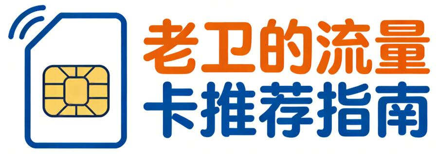

# Data SIM card recommendation. 老卫的流量卡推荐指南

不知道有没有人和我一样，被流量不够用、月租虚高的问题困扰了很久😭 尤其是学生党在宿舍、出差党跑外勤、租房党没装宽带，流量就是刚需，但市面上的流量卡五花八门，稍不注意就踩坑——要么宣传的“大流量”全是定向，要么首月便宜次月暴涨，要么限速阈值低到离谱，甚至还有隐形合约，注销要扣钱。

我个人因为经常会买流量卡作为副卡，也被坑过，因此整理出这份避坑+推荐指南，不管你是每月用几十G还是几百G，不管是追求低价还是稳定，都能找到适合自己的，最后也会分享我实测后觉得靠谱的几款。

关注以下任意仓库均可：

* <https://github.com/waylau/data-sim-card-recommendation>
* <https://gitee.com/waylau/data-sim-card-recommendation>

## 一、先搞懂3个核心问题，避免90%的坑

很多人买流量卡被坑，本质是没看清这3点，被商家的宣传话术带偏了，先把这几点记牢，再选卡绝对不踩雷：

- **分清“通用流量”和“定向流量”**：这是最容易踩坑的点！很多卡宣传“200G流量”，其实180G都是定向（只能用某几个APP），通用流量只有20G，刷视频、逛网页根本不够用。选卡时一定要看清楚，通用流量占比越高越好，定向流量再多，用不上也等于白搭。

- **看明白“优惠期”和“合约期”**：几乎所有低价流量卡都有优惠期（一般6-12个月），优惠期内月租很便宜，但优惠期结束后会恢复原价（可能从9元涨到29元、39元），一定要提前看清楚优惠期时长和后续原价。另外，部分卡有合约期（比如6个月），合约期内注销要扣违约金，短期用的话一定要选无合约的。

- **确认“限速规则”**：没有真正“不限速”的流量卡（这是行业红线，商家说不限速都是假的），大部分卡是通用流量用满一定额度后限速（比如100G后限速3Mbps，200G后限速1Mbps），限速后能正常聊微信、刷文字，但看视频会卡顿，根据自己的使用量选限速阈值就行。

## 二、不同人群最优选择（实测靠谱，无套路）

我根据不同使用场景，整理了3类人群的适配卡，每一款都实测过，没有隐形消费，大家可以对号入座：

### 1. 学生党（预算低、流量需求大）

核心需求：低价、通用流量足、无合约（寒暑假可以注销），适合宿舍没宽带、日常刷视频、玩游戏的学生。

适配类型：月租19元以内，通用流量50-100G，定向流量100-200G，优惠期12个月，无合约，支持线上注销，激活首充50元可享优惠，限速阈值100G（日常用完全够，不怎么卡顿）。

### 2. 出差党（全国通用、稳定不卡顿）

核心需求：全国通用、信号稳定、不限地区使用，偶尔跨省出差，需要随时联网办公、导航。

适配类型：月租29元以内，通用流量100-150G，定向流量不限，优惠期12个月，支持全国漫游，无地区限速（部分偏远地区除外，以运营商为准），限速阈值200G，适合高频使用。

### 3. 租房党（短期使用、灵活注销）

核心需求：无合约、可随时注销、流量够用，暂时没装宽带，或者租房时间不确定，不想被绑定。

适配类型：月租9-19元，通用流量30-50G，定向流量100G，优惠期6个月，无合约，激活无强制首充，用完可直接线上注销，适合短期过渡使用。

## 三、绝对不能碰的“坑卡”（避坑指南）

实测过程中，遇到很多套路卡，大家看到以下几种情况，直接pass，别浪费时间：

1. 宣传“永久0元”“无限流量”“不限速”的：全是虚假宣传，要么首月免费，次月暴涨，要么流量用一点就限速，甚至直接断网。

2. 不说明优惠期和原价的：大概率是优惠期3个月，之后月租涨到39元以上，而且可能有隐形合约，注销要扣钱。

3. 通用流量占比低于30%的：比如200G流量里，通用只有50G，定向150G，看似流量多，实际根本不够用。

4. 需要线下注销、或者注销要收手续费的：现在正规流量卡都支持线上注销（运营商APP操作），需要线下跑营业厅的，大概率是小众卡，售后没保障。

## 四、测评记录集合

选流量卡，没有最好的，只有最适合自己的，不用追求“流量越多越好”，够用、稳定、无套路才是关键。另外，一定要通过正规渠道申请，避免买到物联网卡（不能接打电话、信号差、容易被封）。

以下我的流量卡测评记录集合

* [联通卡](https://space.bilibili.com/7681787/search?keyword=%E8%81%94%E9%80%9A)
* [广电卡](https://space.bilibili.com/7681787/search?keyword=%E5%B9%BF%E7%94%B5)
* [电信卡](https://space.bilibili.com/7681787/search?keyword=%E7%94%B5%E4%BF%A1)
* [移动卡](https://space.bilibili.com/7681787/search?keyword=%E7%A7%BB%E5%8A%A8)
* [随行WiFi](https://space.bilibili.com/7681787/search?keyword=%E9%9A%8F%E8%A1%8CWiFi)

我把实测后靠谱的流量卡整理成了清单放在最后，包含详细的月租、流量、优惠期、注销规则，避免大家再花时间筛选。

## 五、线上销户指南

联通、电信、移动、广电、随行WiFi的流量卡，都支持线上销户，但有坑，大家一定要看 carefully：

* [广电手机卡线上销户过程丝滑](https://www.bilibili.com/video/BV1xdAbzEE1m/)

## 六、流量卡推荐清单

由于流量卡运营周期不确定，短则几天就下架，因此本仓库也会尽量及时更新，增删上架下架的产品。
大家看中好的流量卡及早下手。

### 广电茯苓卡29元200G+0.15元/分钟【可发全国10个省份】复充有礼 

https://2026.haokaxinyao.com/pages/detail/index?goods_id=13340&agent_id=660080

商品介绍：
原资费:39元包20G全国通用 套餐外:通话0.15/分钟，短信0.1/条，流量5元/G
商品副标题： 可发全国10个省份 首月免费 可开副卡
首充描述： 激活快递处专属渠道充值两个100元
运营商/分类： 中国广电
归属地： 随机归属地
商品卖点：
首充100＋复充100
首月免租
可开副卡

套餐信息
套餐时长（优惠期）： 五年
通话时长： 0
通用流量(G)： 200
定向流量(G)： 0
原月租(元)： 39
优惠月租(元)： 29
限制信息
首充金额： ￥100
限龄规则： 18岁 至 65岁
禁发/发货地：
发货地
地区列表：
陕西省
湖南省
四川省
甘肃省
山东省
江西省
广西壮族自治区
贵州省
安徽省

### 广电奔马卡29元192G+0.15元/分钟【发全国】

https://2026.haokaxinyao.com/pages/detail/index?goods_id=13372&agent_id=660080

商品介绍：
原套餐资费：29元/月=30G通用流量 优惠后资费：29元/月=192G通用流量 套外资费：流量3元/G，短信0.1元/条,0.15元/分钟，全国接听免费
商品副标题： 无禁区 自主激活
首充描述： 自主激活时充值100元话费
运营商/分类： 中国广电
归属地： 随机归属地
是否支持选号：
不支持
商品卖点：
自主激活
到期可续
发货率高

套餐信息
套餐时长（优惠期）： 二十年
通话时长： 0
通用流量(G)： 192
定向流量(G)： 0
原月租(元)： 29
优惠月租(元)： 29
限制信息
首充金额： ￥100
限龄规则： 18岁 至 60岁
禁发/发货地：
禁发地
地区列表：
新疆维吾尔自治区
西藏自治区
云南省
北京市
广西壮族自治区
江苏省

### GY联通极速卡39元550G+300分钟+会员【只发四川】

https://2026.haokaxinyao.com/pages/detail/index?goods_id=13369&agent_id=660080

商品介绍：
原套餐资费：39元/月=40G通用流量+50分钟通话 次月原套餐变更为59元/月=50G通用 优惠后资费：39元/月=550G通用流量+300分钟+会员 套餐超出后5元/GB，语音0.15元/分钟，短信0.1元/条，彩信0.5元/条
商品副标题： 只发四川 18-30岁
首充描述： 激活后需任意渠道充值100元
运营商/分类： 中国联通
归属地： 四川省
是否支持选号：

套餐信息
套餐时长（优惠期）： 四年
通话时长： 300
通用流量(G)： 550
定向流量(G)： 0
原月租(元)： 59
优惠月租(元)： 39
限制信息
首充金额： ￥100
限龄规则： 18岁 至 30岁
禁发/发货地：
发货地
地区列表：
四川省

### 联通九寨卡39元240G+200分钟【仅发四川】

https://2026.haokaxinyao.com/pages/detail/index?goods_id=13358&agent_id=660080

商品介绍：
原套餐资费:39元/月=40G通用流量+50分钟语音通话(次月生效) 优惠后资费:39元/月=240G通用流量+200分钟语音通话(次月生效) 首月收费39元，无语音，套外:语音0.15元/分钟，短信0.1元/条，流量5元G无完带，无亲情号;副卡10元/张，最多2张满卡送60G
商品副标题： 可开副卡，上门激活
首充描述： 省内证件充值200元，省外证件充值300元
运营商/分类： 中国联通
归属地： 四川省
是否支持选号：
不支持

套餐信息
套餐时长（优惠期）： 二十年
通话时长： 200
通用流量(G)： 240
定向流量(G)： 0
原月租(元)： 39
优惠月租(元)： 39
限制信息
首充金额： ￥200
限龄规则： 18岁 至 60岁
禁发/发货地：
发货地
地区列表：
四川省

### 移动福气卡39元240G+2000分钟【只发福建】

https://2026.haokaxinyao.com/pages/detail/index?goods_id=13371&agent_id=660080

商品介绍：
原套餐:139元包40G通用流量+1000分钟通话。 超出资费:流量:5元/G，短/彩信:0.1元/条，语音:0.19元/分钟。
商品副标题： 只发福建五地市 18-65周岁 线下派送 激活强充
首充描述： 激活当月需在快递员处充值200元
运营商/分类： 中国移动
归属地： 福建省
是否支持选号：
不支持

套餐信息
套餐时长（优惠期）： 二十年
通话时长： 2000
通用流量(G)： 240
定向流量(G)： 0
原月租(元)： 139
优惠月租(元)： 39
限制信息
首充金额： ￥200
限龄规则： 18岁 至 65岁
禁发/发货地：
发货地
地区列表：
福建省福州市
福建省厦门市
福建省泉州市
福建省漳州市
福建省莆田市

### 联通碧海卡29元/月110G+100分钟【仅发海南】

https://2026.haokaxinyao.com/pages/detail/index?goods_id=12543&agent_id=660080

商品介绍：
原资费:59元80G通用+100分钟， 套餐外流量5元/G，通话0.15元/分钟，短彩信0.1元/条
商品副标题： 上门激活 ，仅发海南，
首充描述： 激活后任意渠道一次性首充100元
运营商/分类： 中国联通
归属地：
是否支持选号：
不支持

餐信息
套餐时长（优惠期）： 两年
通话时长： 100
通用流量(G)： 110
定向流量(G)： 0
原月租(元)： 59
优惠月租(元)： 29
限制信息
首充金额： ￥100
限龄规则： 18岁 至 60岁
禁发/发货地：
发货地
地区列表：
海南省

